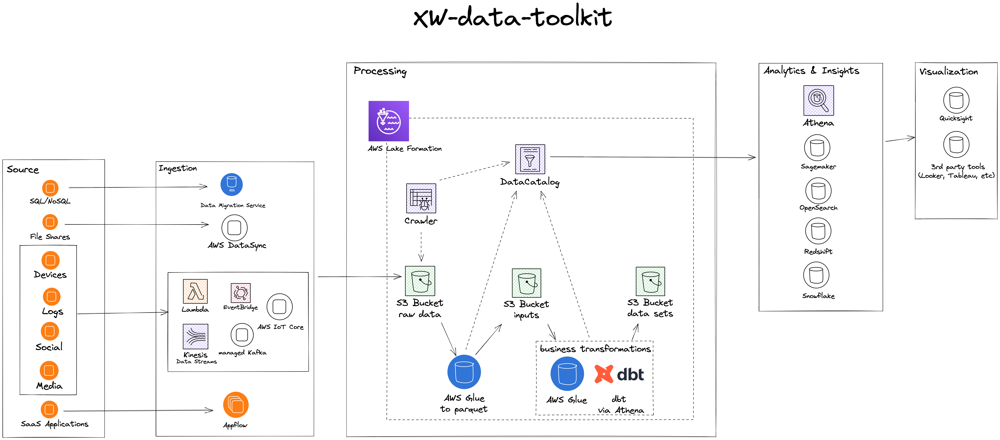

# kreuzLaker

Developing a central data platform that leverages many different sources of an organization's data assets is not a trivial task. A lot of work must be done to ensure high quality, availability and security of the data, but also the scalability of the platform over time.

kreuzLaker provides a blueprint for developers to help them build a secure, data lake-based analytics platform on AWS. While the optimal solution always depends on the specific use case and the data to be provided, kreuzLaker offers modular components that can greatly ease the start of a data-related project.

Currently kreuzLaker is still in alpha version. In this article, we want to show you which components are included for the open source start of the project.

## Batch Architecture

As the start architecture of the kreuzLaker project, clients can use various services such as DMS, Appflow, or Lambda to ingest raw data from various sources into the raw area of the data lake S3 Bucket. 

AWS Glue, a serverless integration service, is used to clean this data and store into the “converted” area of the data lake S3 Bucket, usually in the form of parquet. Next we can perform business transformations to the data via Glue or dbt and load it into a bucket which we call the “data sets” area of the data lake S3 Bucket. [dbt](https://www.getdbt.com/) is the cornerstone of the “modern data stack” ([we wrote already about it](https://kreuzwerker.de/en/post/analytics-stacks-for-startups)) because it enables more people to contribute to the data platform without deep knowledge of the underlying technology as long as they know SQL and, of course, the data itself. In this project, dbt is executed against the serverless query service Amazon Athena.
On top of these Buckets, the Glue Data Catalog  stores metadata about the actual data in all the buckets. It provides a uniform view of the data residing in the Data Lake and enables users and applications to discover data more efficiently. The catalog  gets updated by Glue Crawlers (for the raw data) and during the cleaning and transformation jobs. AWS Lake Formation is used to secure and govern the data lake, making data only available to the users who should be allowed to see it down to row or cell level. With the help of the data catalog, customers can plug in various AWS tools such as  Athena, Sagemaker or Redshift. The first version of kreuzLaker will have [Apache Superset](https://superset.apache.org/), an open source visualization tool, but can be exchanged with other Amazon QuickSight  or third-party tools.

kreuzLaker is implemented with the AWS Cloud Development Kit (CDK), an IaC tool, such that reproducibility, testing, as well as facilitated and easy further development are guaranteed. To this end, Python has been chosen to define the cloud infrastructure as it is one of the most common programming languages in the data domain.

Data lake architectures on AWS tend to show similar patterns in terms of the components used and how they handle different data workflows. With modularity in mind, our team came up with the idea of bringing these patterns together in a single place so that they can be customized for each customer. The blueprints significantly reduce development time for a robust data lake because they can be easily deployed using the AWS CDK. Platform users such as Data Engineers, Data Scientists, and Data Analysts need to worry less about setting up these core components and can instead focus on their core activities.

See [xw-batch/README.md](./xw-batch/README.md) how to get started with kreuzLaker.
